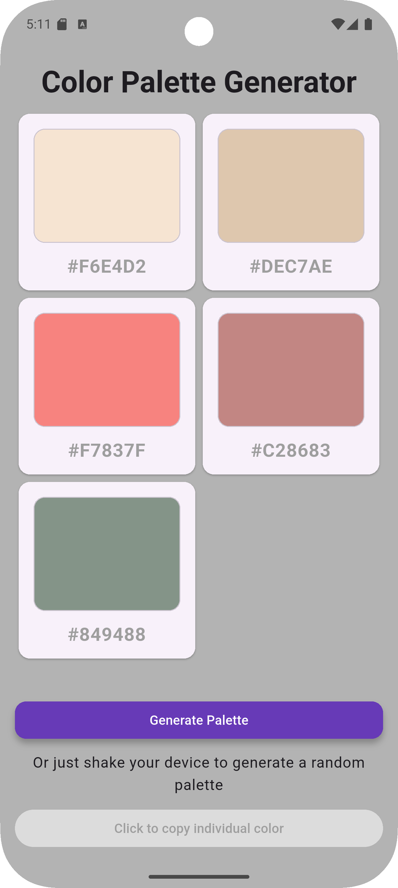

# DevProjects - Random color palette generator mobile app

This is an open source project from [DevProjects](http://www.codementor.io/projects). Feedback and questions are welcome!
Find the project requirements here: [Random color palette generator mobile app](https://www.codementor.io/projects/mobile/random-color-palette-generator-mobile-app-cfkyclpsex)

## Tech/framework used
Built with **Flutter** (using the Dart programming language).

## Description
This Flutter mobile application generates a visually appealing random color palette. It displays a collection of colors, each shown with its hexadecimal code. The app demonstrates the use of Flutter widgets for layout and dynamic content display.

## Features
-   **Random Palette Generation:** (Assuming future implementation - current code shows a fixed list)
    *   *Note: Currently displays a predefined list of colors. Random generation can be added.*
-   **Color Display:** Colors are presented in individual cards.
-   **Hex Code Visibility:** Each color card displays its corresponding hexadecimal value.
-   **Responsive Grid Layout:** Colors are displayed in a grid that adapts to screen space (currently 2 columns).
-   **(Potential Feature) Last Item Centering:** Logic to visually center the last color card if it's the only one in the final row of a 2-column grid.

## Requirements
* [x] Setup a React Native App (Flutter or your favorite framework would work too)
* [x] Display a random color palette when a user opens the mobile app
* [x] Create a button for the user to generate a new color palette
* [x] Allow the user to click on the selected color to copy its HEX code
* [x] Display a notification when the selected color's HEX code has been copied

* ### For an extra challenge
  * [ ] Allow the user to generate a new random color palette by shaking the phone


## Screenshots and demo
*(Placeholder: You need to add screenshots of your running application here. It's highly recommended to show the main screen with the color palette.)*

**Example:**


<!--  -->

*Link to live demo (if available, e.g., a Flutter Web build or a short video): [Your Demo Link Here]*

## Installation
Instructions for other developers on how to install and run your code on their local environment.

### Prerequisites
-   **Flutter SDK:** Ensure Flutter is installed on your system. For installation instructions, visit the [official Flutter documentation](https://flutter.dev/docs/get-started/install).
-   **IDE:** An Integrated Development Environment like Android Studio (with the Flutter plugin) or Visual Studio Code (with the Flutter extension).
-   **Dart SDK:** This is typically bundled with the Flutter SDK.

### Steps to Run
1.  **Clone the repository (if applicable):**
    If the project is hosted on a version control platform like GitHub, clone it to your local machine:

```
git clone https://github.com/your-username/color_palette_generator.git
```

2.  **Navigate to the project directory:**
    Change your current directory to the project folder:

```
cd color_palette_generator    
```    

3.  **Run the application:**
    Use the Flutter command to run the application:

```
flutter pub get
flutter run    
```    

## Project Structure Overview (Simplified)
```
color_palette_generator/ 
│   
├── lib/ 
│   
├── main.dart       # Main application entry point 
│   
├── home_page.dart  # Main screen widget, displays the color palette 
│   
└── card_color.dart # Widget for displaying a single color card 
├── android/        # Android specific project files 
├── ios/            # iOS specific project files 
├── assets/         # (Create this folder for your screenshots, e.g., assets/screenshot_palette.png) 
├── pubspec.yaml    # Project metadata and dependencies 
└── README.md       # This file
```