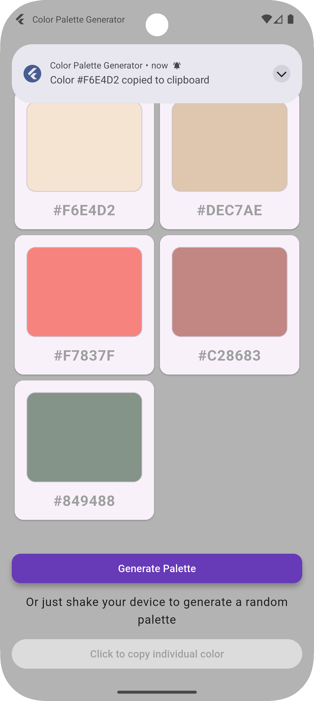

# 🏡 DevProjects - Random color palette generator mobile app

This is an open source project from [DevProjects](http://www.codementor.io/projects). Feedback and questions are welcome!
🔗 Project requirements: [Random color palette generator mobile app](https://www.codementor.io/projects/mobile/random-color-palette-generator-mobile-app-cfkyclpsex)

## 📖 Description
This Flutter mobile application allows users to generate a visually appealing random color palette. It displays a collection of colors, each shown with its hexadecimal code. The app also demonstrates how to handle runtime permissions for features like notifications, including guiding users to app settings if permissions are permanently denied.
---

## 🚀 Features
-   **Random Palette Generation**
-   **Color Display:** Colors are presented in individual cards.
-   **Hex Code Visibility:** Each color card displays its corresponding hexadecimal value.
-   **Responsive Grid Layout:** Colors are displayed in a grid that adapts to screen space (currently 2 columns).
-   **Notification System:** 
    *   Requests user permission to display notifications.
    *   Handles cases where notification permission is denied or permanently denied by prompting the user to open app settings.
    *   Displays a notification (e.g., when a color's HEX code is copied)
-   **Shake Detection:** Shake the device to generate a new palette.

---

## 📸 Screenshots & Demo



---

## 🛠️ Tech Stack
Built with **Flutter** (using the Dart programming language).
- **Key Packages**:
  - `flutter_local_notifications`: For displaying local notifications.
  - `permission_handler`: For checking and requesting permissions, and guiding users to app settings.
  - `shake`: For detect phone shakes.
---

## 📂 Project Structure
```
lib/
│
├── core/
│   ├── network/
│   │   ├── api_exceptions.dart
│   │   └── dio_client.dart
│   ├── notifications/
│   │   └── notification_service.dart
│   ├── themes/
│   │   └── app_theme.dart
│   └── utils/
│       ├── app_alert_dialog.dart
│       ├── app_snack_bar.dart
│       └── constants.dart
│
├── features/
│   └── colors_palette/
│       ├── data/
│       │   ├── api_repository.dart
│       │   ├── api_service.dart
│       │   └── models/
│       │       └── generated_palette.dart
│       ├── presentation/
│       │   └── home_page.dart
│       └── providers/
│           ├── colors_providers.dart
│           └── shake_provider.dart
│
├── widgets/
│   └── card_color.dart
│
└── main.dart
```
---

## 🟦 Requirements
* [x] Setup a React Native App (Flutter or your favorite framework would work too)
* [x] Display a random color palette when a user opens the mobile app
* [x] Create a button for the user to generate a new color palette
* [x] Allow the user to click on the selected color to copy its HEX code
* [x] Display a notification when the selected color's HEX code has been copied
* [x] (Extra challenge) Allow the user to generate a new random color palette by shaking the phone
---

## ⚙️ Installation & Setup

### Prerequisites
-   **Flutter SDK:** Ensure Flutter is installed on your system. For installation instructions, visit the [official Flutter documentation](https://flutter.dev/docs/get-started/install).
-   **Dart SDK:** This is typically bundled with the Flutter SDK.
-   **IDE:** An Integrated Development Environment like Android Studio (with the Flutter plugin) or Visual Studio Code (with the Flutter extension).
-   **Android Specific (for Notifications on API 33+):**
    Ensure your `android/app/src/main/AndroidManifest.xml` includes:
    ```
    <!--    Internet permission-->
    <uses-permission android:name="android.permission.INTERNET"/>
    <!--    Notification permissions  -->
    <uses-permission android:name="android.permission.POST_NOTIFICATIONS" />
    ```


### Steps to Run
1.  **Clone the repository (if applicable):**
    If the project is hosted on a version control platform like GitHub, clone it to your local machine:

```
git clone https://github.com/your-username/color_palette_generator.git
```

2.  **Navigate to the project directory:**
    Change your current directory to the project folder:

```
cd color_palette_generator    
```    

3.  **Run the application:**
    Use the Flutter command to run the application:

```
flutter pub get
flutter run    
```
---

## 📖 Usage
1. Launch the app
2. Generate a palette
    * Tap the "Generate Palette" button
    * Or shake the phone
3. Tap a color card to copy its HEX code 
4. A notification will confirm the HEX code was copied
---

## 🤝Contributing

### Contributions are welcome! 🎉

1. Fork the repository
2. Create a new branch → `(git checkout -b feature-branch)`
3. Commit changes → `git commit -m "Add feature XYZ"`
4. Push changes → `git push origin feature-branch`
5. Open a Pull Request.